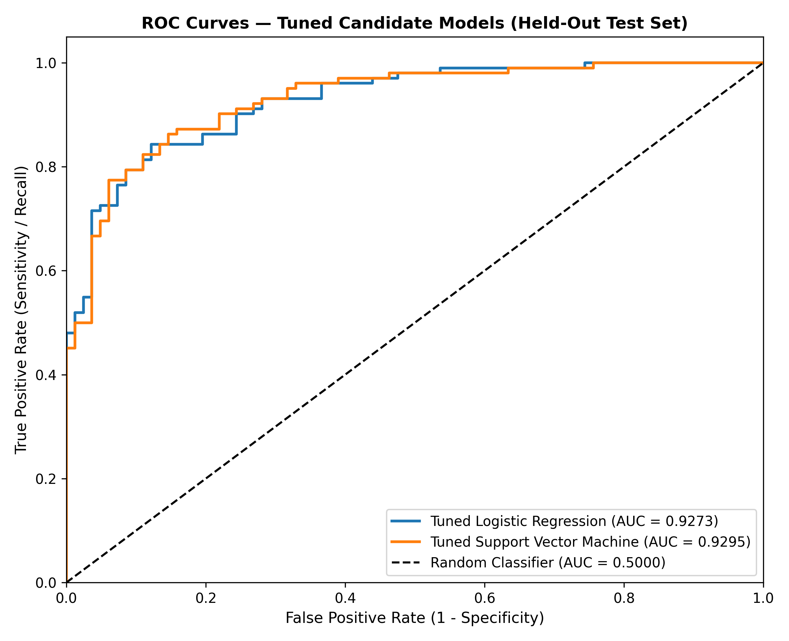
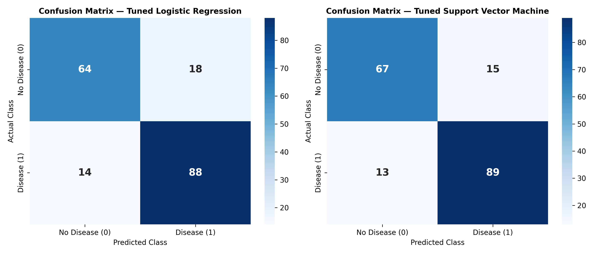
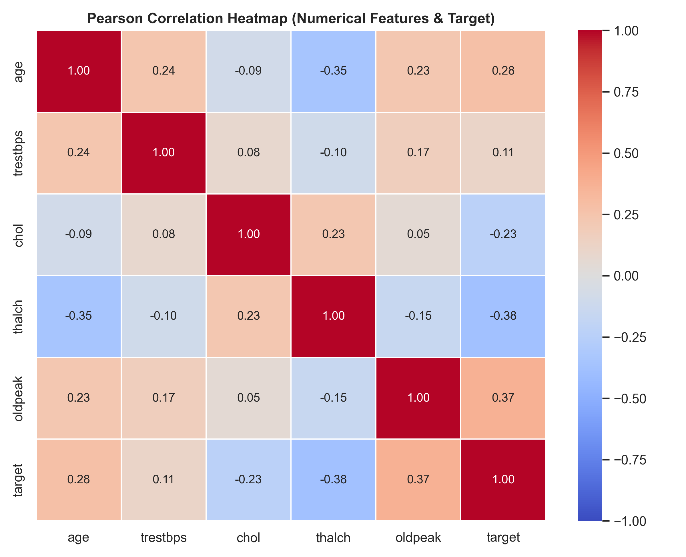
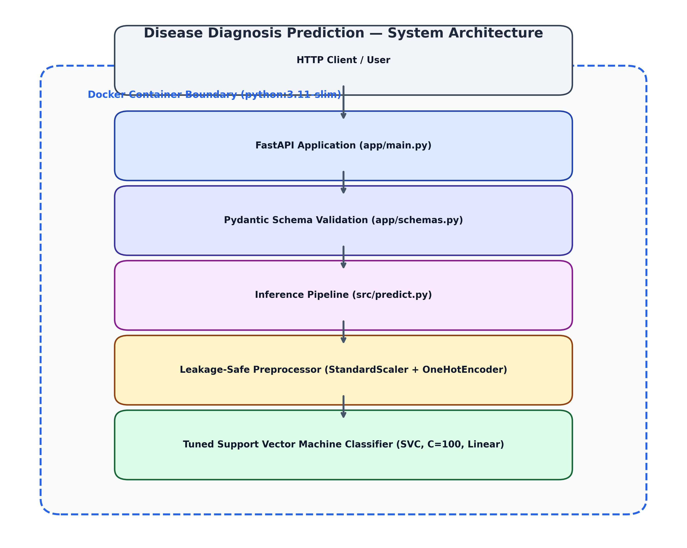

# Disease Diagnosis Prediction Using Clinical Data and Classification Models


Production-structured, end-to-end machine learning system for heart disease risk classification built on clinical data ($N=918$). The project features a leakage-safe preprocessing pipeline, comprehensive benchmarking across 5 classification algorithms, hyperparameter-tuned Support Vector Machine (`SVC`), automated model persistence, a reusable prediction module, a RESTful FastAPI microservice with Pydantic schema validation, and lightweight Docker containerization verified with 170 automated unit tests.

> [!WARNING]
> **Non-Clinical Disclaimer**: This application is a machine-learning research prototype developed to demonstrate software design and predictive modeling workflows. It is **not a clinically validated diagnostic system** and must not be used for medical diagnosis or clinical decision-making.

---

## Key Performance Results (Held-Out Test Set, $N=184$)

All evaluation metrics were computed on a held-out test dataset ($N=184$, stratified 80/20 split) that remained completely isolated throughout preprocessing fitting, baseline training, and hyperparameter optimization.

| Metric | Empirical Score | Interpretation / Evaluation Context |
| :--- | :--- | :--- |
| **Selected Final Model** | **Tuned Support Vector Machine** | `SVC(C=100, kernel="linear", gamma="scale", probability=True, random_state=42)` |
| **Test Accuracy** | **84.78%** | 156 correct predictions out of 184 test observations |
| **Test Precision** | **85.58%** | 89 true positives out of 104 positive predictions |
| **Test Recall (Sensitivity)** | **87.25%** | 89 positive cases identified out of 102 actual positive cases |
| **Test Specificity** | **81.71%** | 67 negative cases correctly identified out of 82 actual negative cases |
| **Test F1-Score** | **0.8641** | Harmonic mean of precision and recall |
| **Test ROC-AUC** | **0.9295** | High area under ROC curve demonstrating strong class discrimination |
| **Average Precision (PR-AUC)**| **0.9455** | High area under precision-recall curve for positive class |
| **Test Confusion Matrix** | $\text{TN}=67, \text{FP}=15, \text{FN}=13, \text{TP}=89$ | False Positive Rate: 18.29%; False Negative Rate: 12.75% |

---

## Visual Model Evaluation & Diagnostic Visualizations

### 1. Model Discrimination & ROC Curves

*Figure 1: Receiver Operating Characteristic (ROC) curve comparing tuned candidate models on the held-out test set ($N=184$). The tuned Linear SVM achieves an ROC-AUC score of 0.9295.*

### 2. Final Model Confusion Matrix

*Figure 2: Confusion matrix heatmaps for tuned candidate models demonstrating classification performance across True Negatives ($67$), False Positives ($15$), False Negatives ($13$), and True Positives ($89$).*

### 3. Feature Correlation Analysis

*Figure 3: Pairwise correlation heatmap across clinical numerical features, showing absence of high multicollinearity ($|r| < 0.40$ among numerical predictors).*

---

## Technology Stack

- **Core Language & Math**: `Python 3.11 / 3.12 / 3.13`, `NumPy`, `Pandas`
- **Machine Learning**: `Scikit-Learn` (`SVC`, `LogisticRegression`, `RandomForestClassifier`, `KNeighborsClassifier`, `DecisionTreeClassifier`, `StandardScaler`, `OneHotEncoder`, `GridSearchCV`, `Pipeline`), `Joblib`
- **Visualization**: `Matplotlib`, `Seaborn`
- **Web API Microservice**: `FastAPI`, `Pydantic v2`, `Uvicorn`
- **Containerization & Deployment**: `Docker`, `Docker Compose`
- **Software Quality & Testing**: `Pytest`, `HTTPX`

---

## System Architecture & Processing Flow

```
Clinical Dataset (N=918)
       │
       ▼
Data Understanding & EDA ──► Suspicious zero-cholesterol values (N=172) identified
       │
       ▼
Leakage-Safe Preprocessing ──► Median Imputer + StandardScaler + OneHotEncoder (Fitted strictly on X_train)
       │
       ▼
Baseline Model Training ──► Evaluated 5 Classifiers (Logistic Regression, KNN, DT, RF, SVM)
       │
       ▼
Hyperparameter Optimization ──► 5-Fold Stratified GridSearchCV (Selected Tuned Linear SVM, C=100)
       │
       ▼
Advanced Evaluation ──► ROC-AUC (0.9295), PR-AUC (0.9455), Out-of-fold Brier Score (0.1376)
       │
       ▼
Pipeline Persistence ──► models/final_model.joblib & models/model_metadata.json
       │
       ▼
Inference Pipeline ──► src/predict.py (Reusable Single & Batch Prediction Engine)
       │
       ▼
FastAPI REST Application ──► app/main.py (POST /predict, POST /predict/batch)
       │
       ▼
Docker Containerization ──► python:3.11-slim Container (Non-root appuser execution)
```

### Containerized Application Boundary


*Figure 4: System Architecture flow detailing HTTP request routing, Pydantic schema validation, inference pipeline, preprocessor, and tuned SVM classifier inside the Docker container.*

---

## Key Engineering & Machine Learning Features

1. **Strict Data Leakage Isolation**: Train ($N=734$) and held-out test ($N=184$) sets were separated prior to any transformation. Imputers, scalers, and encoders were fitted **exclusively on `X_train`**.
2. **Robust Data Quality Treatment**: Unrecorded zero-cholesterol entries (`chol == 0`, $N=172$) were converted to missing values in-memory and imputed via training set median. Negative `oldpeak` entries were preserved based on physiological validity.
3. **Encapsulated Pipeline Persistence**: The fitted preprocessor and classifier are saved as a single scikit-learn `Pipeline` object (`models/final_model.joblib`), ensuring identical transformation logic during REST API inference.
4. **Production FastAPI Service**: Exposes robust REST endpoints with strict Pydantic input validation, custom error handlers, and OpenAPI interactive documentation (`/docs`).
5. **Multi-Stage Dockerization**: Packaged into a minimal `python:3.11-slim` container running under non-root security privileges (`appuser`), verified to yield $< 10^{-6}$ probability delta compared to local execution.
6. **Comprehensive Automated Test Coverage**: 170 automated unit, pipeline, API, and container parity tests achieving 100% pass rate.

---

## Dataset Provenance & Setup Instructions

The project utilizes the **Cleveland / UCI Heart Disease dataset** ($N=918$ observations, 11 original columns).

> [!NOTE]
> **Dataset Redistribution Policy**: The raw dataset CSV (`data/raw/heart_disease.csv`) is **intentionally excluded from public Git tracking** via `.gitignore` because explicit redistribution permissions for the exact local file format were not independently established.
> The repository contains all source code, model artifacts, API endpoints, tests, Docker configurations, and technical reports. The persisted model (`models/final_model.joblib`) allows the microservice to run out-of-the-box without requiring local dataset downloading or model retraining.

### Local Dataset Setup for EDA / Retraining

If you wish to run exploratory data analysis notebooks or retrain the models locally:

1. Download the Cleveland / UCI Heart Disease dataset from the official public source:
   - [UCI Machine Learning Repository — Heart Disease Dataset](https://archive.ics.uci.edu/ml/datasets/Heart+Disease)
2. Save the CSV file locally to:
   ```
   data/raw/heart_disease.csv
   ```
3. Confirm raw file structure:
   - **Observations**: 918 rows
   - **Original Predictors (10)**: `age`, `sex`, `cp`, `trestbps`, `chol`, `fbs`, `restecg`, `thalch`, `exang`, `oldpeak`
   - **Original Target (1)**: `num` (transformed in-memory as $\text{target} = (\text{num} > 0)$)

---

## Project Directory Structure

```
Disease-Diagnosis-Prediction/
├── frontend/                   # Interactive Web Frontend (Additive UI Layer)
│   ├── index.html              # Modern dashboard layout & form controls
│   ├── styles.css              # Glassmorphic CSS design system
│   └── app.js                  # API integration & DOM state manager
├── app/                        # FastAPI Web Microservice
│   ├── __init__.py
│   ├── main.py                 # FastAPI application routes & startup logic
│   └── schemas.py              # Pydantic input/output validation schemas
├── src/                        # Machine Learning Source Code Modules
│   ├── __init__.py
│   ├── config.py               # Global constants, paths, and random seeds
│   ├── data_loader.py          # Data ingestion and verification
│   ├── preprocessing.py       # Leakage-safe preprocessing transformers
│   ├── train.py                # Model training and baseline benchmarking
│   ├── evaluate.py             # Metric calculations & confusion matrices
│   ├── model_analysis.py       # Feature importances & logistic coefficients
│   ├── advanced_evaluation.py  # ROC curves, precision-recall, calibration
│   ├── model_selection.py      # Candidate selection logic
│   ├── model_persistence.py    # Pipeline serialization & metadata logging
│   └── predict.py              # Reusable inference prediction engine
├── data/
│   ├── raw/
│   │   └── .gitkeep            # Folder placeholder (CSV excluded from Git)
│   └── processed/
│       └── .gitkeep            # Processed data directory placeholder
├── models/
│   ├── final_model.joblib      # Persisted scikit-learn pipeline artifact (~54.5 KB)
│   └── model_metadata.json     # Model hyperparameters & training metadata
├── notebooks/                  # Step-by-Step Jupyter Notebooks (Phases 1-9)
│   ├── 01_data_understanding.ipynb
│   ├── 02_eda.ipynb
│   ├── 03_preprocessing.ipynb
│   ├── 04_model_training.ipynb
│   ├── 05_model_analysis.ipynb
│   ├── 06_hyperparameter_tuning.ipynb
│   ├── 07_advanced_evaluation.ipynb
│   ├── 08_final_model_selection.ipynb
│   └── 09_model_persistence.ipynb
├── reports/                    # Technical Documentation & Reports
│   ├── final_project_report.md # 33-section comprehensive technical report
│   ├── final_metrics_table.csv # Structured benchmark metrics
│   ├── project_configuration_summary.md
│   ├── public_repository_manifest.md
│   ├── license_and_publication_status.md
│   ├── git_initialization_report.md
│   ├── github_publication_report.md
│   ├── github_optimization_status.md
│   └── figures/                # High-res visual figures & ROC curves
├── tests/                      # Automated Pytest Test Suite
│   ├── conftest.py             # Pytest fixtures and test client setup
│   ├── test_data_loader.py     # Data ingestion & schema tests
│   ├── test_preprocessing.py   # Leakage isolation & transformer tests
│   ├── test_train.py           # Training logic & model fitting tests
│   ├── test_evaluate.py        # Metric calculation tests
│   ├── test_model_persistence.py # Joblib serialization & reproducibility
│   ├── test_predict.py         # Single & batch inference tests
│   ├── test_api.py             # FastAPI REST endpoint & schema tests
│   └── test_docker.py          # Docker configuration & parity tests
├── Dockerfile                  # Multi-stage production Docker build
├── docker-compose.yml          # Docker Compose service orchestration
├── .dockerignore               # Container build exclusions
├── .gitignore                # Git repository exclusions
├── requirements.txt            # Python dependency pins
├── LICENSE                     # MIT License
└── README.md                   # Master project documentation
```

---

## Local Installation & Execution

### Prerequisites
- Python 3.11, 3.12, or 3.13
- Git

### 1. Clone Repository & Create Virtual Environment
```bash
git clone https://github.com/dhinakarananburose/Disease-Diagnosis-Prediction.git
cd Disease-Diagnosis-Prediction
python -m venv .venv
source .venv/bin/activate  # On Windows: .venv\Scripts\activate
```

### 2. Install Dependencies
```bash
pip install -r requirements.txt
```

### 3. Execute Automated Test Suite
```bash
pytest -q
```
*Expected result: 170 passed cleanly.*

### 4. Launch FastAPI Server & Interactive Web UI
Start the FastAPI Uvicorn server locally:
```bash
uvicorn app.main:app --host 0.0.0.0 --port 8000
```

Access the application in your web browser:
- **Interactive Web UI**: [http://localhost:8000/ui](http://localhost:8000/ui) (or open `frontend/index.html` directly)
- **Interactive OpenAPI Documentation**: [http://localhost:8000/docs](http://localhost:8000/docs)
- **Health Check Status**: [http://localhost:8000/health](http://localhost:8000/health)

**Architecture Flow**: `Browser UI (frontend/)` ──► `FastAPI REST Microservice (app/main.py)` ──► `Inference Engine (src/predict.py)` ──► `Fitted Preprocessor + Tuned SVM Pipeline (models/final_model.joblib)`

---

## Docker Deployment Guide

### Prerequisites
- [Docker Desktop](https://www.docker.com/products/docker-desktop/) or Docker Engine (v20.10+)
- Docker Compose (v2.0+)

### 1. Build Container Image
```bash
docker build -t disease-diagnosis-api .
```

### 2. Launch Container Microservice
```bash
docker compose up -d
```
The application will launch in the background, listening on port `8000`.

### 3. Verify Health Endpoint
```bash
curl http://localhost:8000/health
```

### 4. Stop Container Service
```bash
docker compose down
```

---

## REST API Documentation & Endpoints

Interactive Swagger documentation is available live at `http://localhost:8000/docs`.

### API Endpoints

| Method | Endpoint | Description |
| :--- | :--- | :--- |
| `GET` | `/` | API status and welcome metadata |
| `GET` | `/health` | Health check endpoint and model loading status |
| `POST` | `/predict` | Predict heart disease class and probability for a single observation |
| `POST` | `/predict/batch` | Predict heart disease class and probability for a batch of observations |

---

### Input Schema (`PredictionInput`)

| Feature Name | Type | Valid Range / Categories | Description |
| :--- | :--- | :--- | :--- |
| `age` | `integer` / `number` | $1 \le \text{age} \le 120$ | Patient age in years |
| `sex` | `string` / `integer` | `"Male"`, `"Female"`, `1`, `0` | Biological sex |
| `cp` | `string` | `"asymptomatic"`, `"non-anginal"`, `"typical angina"`, `"atypical angina"` | Chest pain type |
| `trestbps` | `number` | $0 \le \text{trestbps} \le 300$ | Resting blood pressure (mm Hg) |
| `chol` | `number` | $0 \le \text{chol} \le 1500$ | Serum cholesterol (mg/dl; $0$ imputed as missing) |
| `fbs` | `boolean` / `string` / `number` | `true`, `false`, `1`, `0` | Fasting blood sugar > 120 mg/dl |
| `restecg` | `string` | `"normal"`, `"st-t abnormality"`, `"lv hypertrophy"` | Resting ECG results |
| `thalch` | `number` | $1 \le \text{thalch} \le 250$ | Maximum heart rate achieved |
| `exang` | `boolean` / `string` / `number` | `true`, `false`, `1`, `0` | Exercise induced angina |
| `oldpeak` | `number` | $-10.0 \le \text{oldpeak} \le 15.0$ | ST depression induced by exercise relative to rest |

---

### Example Prediction Request (`POST /predict`)

#### cURL Request:
```bash
curl -X 'POST' \
  'http://localhost:8000/predict' \
  -H 'Content-Type: application/json' \
  -d '{
    "age": 58,
    "sex": "Male",
    "cp": "asymptomatic",
    "trestbps": 140,
    "chol": 240,
    "fbs": false,
    "restecg": "normal",
    "thalch": 130,
    "exang": true,
    "oldpeak": 2.5
  }'
```

#### JSON Response (`PredictionResponse`):
```json
{
  "predicted_class": 1,
  "predicted_probability": 0.8842,
  "model_name": "Tuned Support Vector Machine"
}
```
*Interpretation: Class `1` represents positive prediction for Heart Disease.*

---

## Methodological Limitations

1. **Sample Size**: Evaluated on $N=918$ clinical observations; generalization to broader clinical populations requires larger prospective datasets.
2. **Missing Value Imputation**: Suspicious zero-cholesterol values ($N=172$) were converted to missing values and imputed using training set median; prospective clinical deployment should ensure complete data capture.
3. **Threshold Boundary**: Model outputs use the default decision threshold ($0.50$). Optimal clinical decision boundaries should be selected based on specific institutional risk tolerance.
4. **Statistical Association**: Model feature importances and coefficients describe statistical relationships within the fitted dataset and do not imply direct biological causality.

---

## License & Source Provenance

- **Original Project Code & Materials**: Released under the **[MIT License](LICENSE)** (Copyright (c) 2026 Dhinakaran Anburose).
- **Third-Party Clinical Dataset**: Derived from the Cleveland / UCI Heart Disease dataset. Excluded from public Git tracking. Users acquiring raw data directly from the UCI Machine Learning Repository must comply with applicable source terms. The MIT License applies exclusively to original project source code, microservice implementation, Docker configuration, and original technical documentation.
